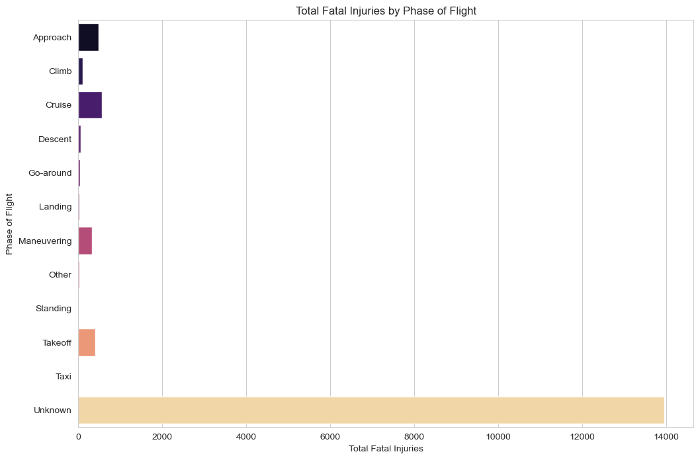
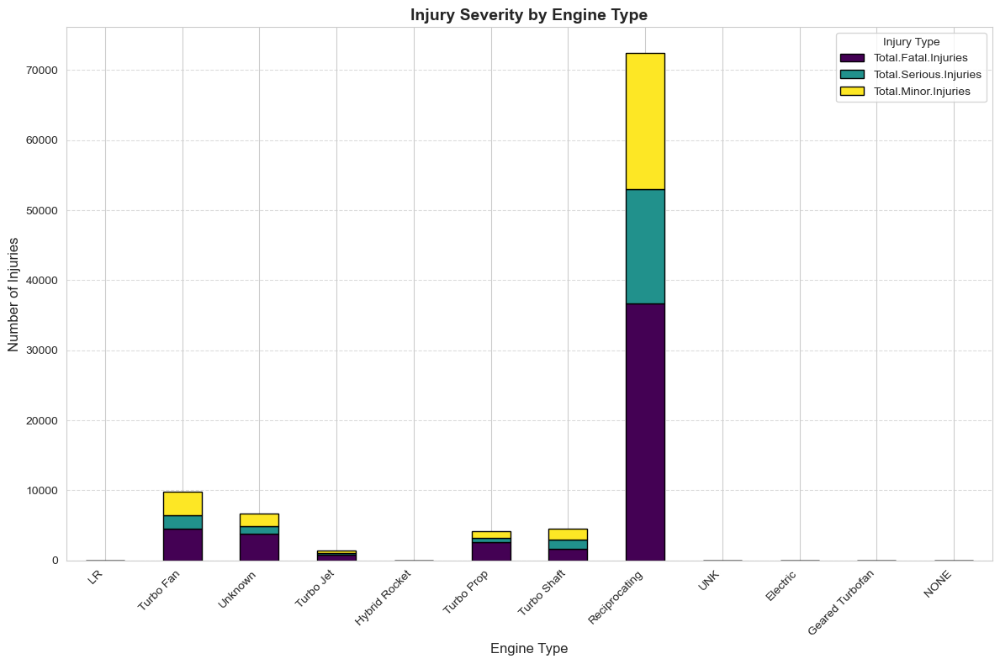
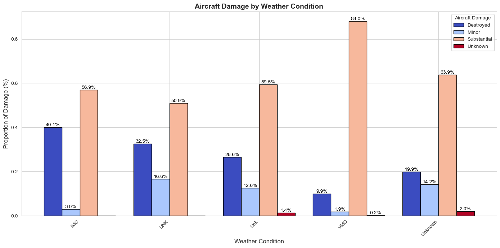

# Aviation Safety Analysis

## Overview
This analysis project focuses on evaluating aviation safety data to help a company make informed decisions about aircraft purchases and operations. By analyzing historical accident data, we aim to identify the safest aircraft models, engine types, and operating conditions to minimize risks in aviation operations.

## Business Understanding
### Stakeholders
- Company executives making aircraft purchase decisions
- Operations management team
- Safety officers
- Flight operations personnel

### Key Business Questions
1. Which aircraft models have the best safety records?
2. What engine types are associated with fewer accidents and lower injury rates?
3. How do weather conditions impact accident severity?
4. Which phases of flight present the highest risks?

## Data Understanding and Analysis
### Source of Data
The analysis uses the dataset from [Kaggle](https://www.kaggle.com/datasets/khsamaha/aviation-accident-database-synopses), which contains comprehensive information about civil aviation accidents and incidents in the United States and international waters from 1962 to 2023.

### Description of Data
Key data points analyzed include:
- Event Date
- Injury Severity
- Aircraft Damage
- Make and Model
- Engine Type
- Injury Statistics (Fatal, Serious, Minor, Uninjured)
- Weather Conditions
- Phase of Flight

### Visualizations

1. Aircraft Model vs Fatal Injuries
    

2. Engine Type Safety Comparison
    

3.Weather Condition Impact on Accidents
    

## Interactive DashBoard
[ View the DashBoard](https://public.tableau.com/views/AviationAccidentUpdatedDashboard/AviationAccidentDashboard?:language=en-GB&:sid=&:redirect=auth&:display_count=n&:origin=viz_share_link)

## Conclusion
### Key Findings
1. **Aircraft Model Safety**
   - Certain models (Tupolev, Viking Air Limited, and Aviocar CASA) show higher rates of fatal injuries
   - Some models consistently demonstrate better safety records
2. **Engine Type Impact**
   - Geared Turbofan engines show superior safety performance
   - Electric engine types demonstrate lower risk scores
   - Reciprocating engines have higher accident severity rates
3. **Operational Conditions**
   - Weather conditions significantly impact accident likelihood
   - Takeoff and landing phases present the highest risk
   - IMC (Instrument Meteorological Conditions) correlate with higher fatality rates
### Recommendations
1. **Aircraft Selection**
   - Avoid aircraft models with historically high fatal injury rates (Tupolev, Viking Air Limited, Aviocar CASA)
   - Prioritize aircraft equipped with Geared Turbofan engines
   - Consider electric engine options where feasible
2. **Operational Safety**
   - Implement additional safety measures during takeoff and landing phases
   - Exercise extra caution during adverse weather conditions
   - Avoid operations in IMC when possible
3. **Engine Considerations**
   - Prioritize aircraft with Geared Turbofan engines over reciprocating engines
   - Focus on engines with proven lower risk scores
   - Consider maintenance history and reliability in engine selection

